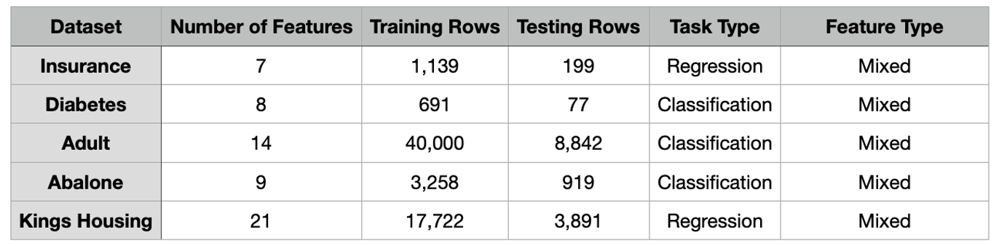

**This is the repository for the thesis work "Enhancing the Privacy and Utility of Synthetic Datasets with Generative Machine Learning"  done at Communication Systems Group, University of Zurich, supervised by Mr. Weijie Niu, Dr. Alberto Huertas Celdran and Prof. Dr. Burkhard Stiller.**

# Synthetic Data Privacy and Utility Framework

This project is based on the paper "TabuLa: Harnessing Language Models for Tabular Data Synthesis" by Zilong Zhao, Robert Birke, and Lydia Chen. Their paper proposes a new method for generating synthetic datasets using language models, which is faster and more efficient than traditional methods, Tabula. In this project, we implement the DP-SGD algorithm into the training process of Tabula, which can be found in `tabula_trainer.py` and the initialization file is `tabula.py`. By adjusting the noise level, we get different levels of privacy and utility. And by using the previous work *Design and Implementation of a Platform for Privacy Assessment of Synthetic Data Generation with Generative AI*, we can evaluate the privacy and utility of the synthetic datasets. This project is to evaluate the privacy and utility of the synthetic datasets generated by Tabula with DP-SGD to find a balance between privacy and utility.


## Prerequisites
The python version 3.10 was used to develop this framework. All experiments are conducted in Colab with A100 GPU. Please be noted to change the path for original dataset and synthetic datasets

For the following packages, these versions were used:
- Numpy version: 1.26.4
- Pandas version: 2.2.2
- SDV version: 1.15.0
- Scikit-learn version: 1.5.1
- Seaborn version: 0.12.2
- Matplotlib version: 3.9.2
- RDT version: 1.12.3
- Anonymeter version: 1.0.0
- Scipy version: 1.13.0
- Dython version: 0.7.8
- OT version: 0.9.4
- datasets >= 2.5.2
- torch >= 1.10.2
- tqdm >= 4.64.1
- transformers >= 4.22.1

## Installation
Cloning this repository for DP-Tabula and the [evaluation framework](https://github.com/Karo2222/synprivutil.git) is needed.

## Content

- **Real_Datasets**: 
In this folder, the original datasets as well as their training and test datasets are stored into corresponding folders. 


- **Synthetic_Datasets**: 
Here is the link of [synthetic datasets](https://drive.google.com/drive/folders/1EhOJ-q0_sxLNJjY66fVLxPvkk9iy86yR?usp=sharing)

- **dp_tabula**:
  - **dp_tabula**: Main implementation of the Tabula model with DP parameters
  - **dp_tabula_trainer**: Training implementation with DP-SGD
  - **tabula_start**: Initialization and startup code

- **model_training**:
In this folder, the training process for different datasets are stored. It tells the specific parameters and also the noise level for each dataset.

- **evaluation**:
In this folder, the evaluation process for different datasets are stored. The evaluation process takes three metrics:
  - **statistical similarity** 
  - **privacy metrics** 
  - **machine learning metrics** 
  - **feature comparison plot**

- **comparison_plots**:
In this folder, the plots for the comparison between the original and synthetic datasets for each feature are stored. For each dataset, there exist the metrics value in table format and the plot of the metrics value under different noise levels. Inside the plot folder, there are the comparison plots for each feature between the original and synthetic datasets under different noise levels.


## Example Usage

Below is an example of how to generate synthetic data using the `DP-Tabula`.

```python
# Import the necessary libraries and the DP-Tabula model
from dp_tabula import DP_Tabula
import pandas as pd
import torch

# Load original dataset
train_data = pd.read_csv('../examples/Real_Datasets/insurance/insurance_train.csv')

# Create the DP-Tabula model
model = DP_Tabula(
    llm='distilgpt2', # The llm taken
    experiment_dir="insurance_training",
    batch_size=64,
    epochs=400,
    categorical_columns=["sex", "children", "sm", "region"], # categorical columns, different for each dataset
    use_dp=True,
    clip_coeff=1,
    sigma=0.01, # noise level
    micro_batch_size=16,
    learning_rate=5e-4
)

# Load the model, can be downloaded from [here](https://drive.google.com/file/d/1_YxelekxY5MXhgn93MYgsZEEfBYAy7h6/view) and put it in the pretrained-model folder

# In Tabula, they compare three models:
# Pre-trained DistilGPT-2 – A model trained on NLP tasks, which performed the worst for tabular data synthesis.
# Randomly initialized DistilGPT-2 – A model with no pre-training, which converged faster than the NLP pre-trained model.
# Fine-tuned DistilGPT-2 on tabular data (e.g., Intrusion dataset) – A model trained from scratch and then fine-tuned on tabular data, achieving the best performance.

# This model downloaded is a pre-trained DistilGPT-2 model fine-tuned on the Intrusion dataset, as our foundation model. 


model.model.load_state_dict(torch.load("pretrained-model/model.pt"), strict=False)
# Fit the model on the data (Where DP is added into the training process)
model.fit(train_data)

# Save the trained model
torch.save(model.model.state_dict(), "insurance_training/model_400epoch.pt")

# Generate synthetic data and save it
synthetic_data = model.sample(n_samples=train_data.shape[0]) # Same size as the training data
synthetic_data.to_csv(f"insurance_syn_data/insurance-sigma-{sigma_str}.csv", index=False)

```

